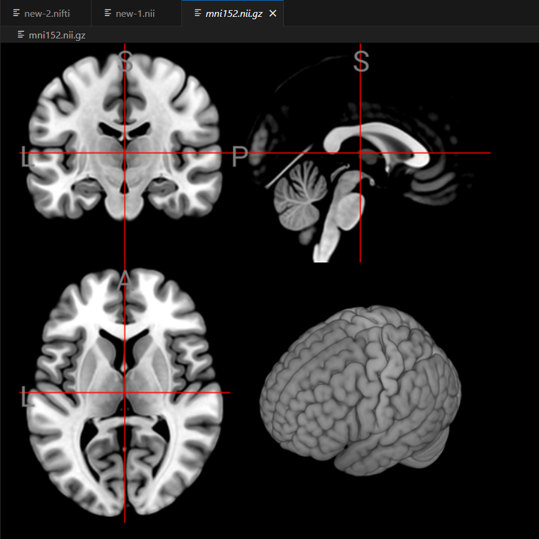
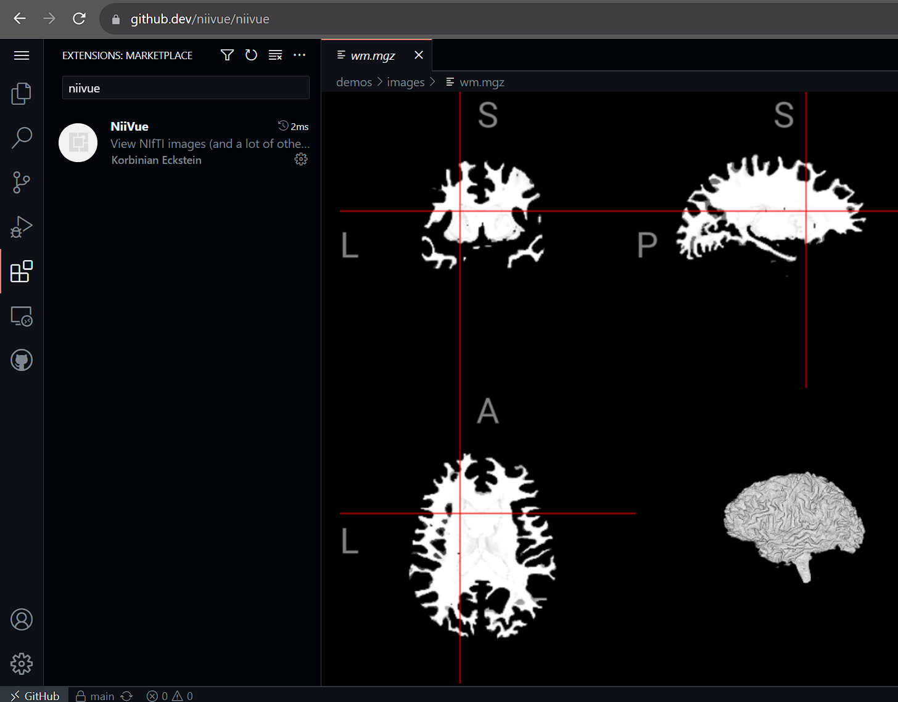

# NiiVue README

[NiiVue](https://github.com/niivue/niivue) is a WebGL 2.0 medical image viewer. This extension uses NiiVue to display images selected in VSCode.  


## Features

- Open local files by selecting them in the VSCode explorer
- Open remote files with the command "NiiVue: Open Image" (`Ctr+Shift+P`)
- Open local or remote files when hovering over the link
- NiiVue hotkeys
- contrast adjustment by windowing with right mouse button
- Works in web-based VSCode


## Supported Formats

NiiVue can open several formats popular with brain imaging:

- Voxel-based formats: [NIfTI](https://brainder.org/2012/09/23/the-nifti-file-format/), [NRRD](http://teem.sourceforge.net/nrrd/format.html), [MRtrix MIF](https://mrtrix.readthedocs.io/en/latest/getting_started/image_data.html#mrtrix-image-formats), [AFNI HEAD/BRIK](https://afni.nimh.nih.gov/pub/dist/doc/program_help/README.attributes.html), [MGH/MGZ](https://surfer.nmr.mgh.harvard.edu/fswiki/FsTutorial/MghFormat), [ITK MHD](https://itk.org/Wiki/ITK/MetaIO/Documentation#Reading_a_Brick-of-Bytes_.28an_N-Dimensional_volume_in_a_single_file.29), [ECAT7](https://github.com/openneuropet/PET2BIDS/tree/28aae3fab22309047d36d867c624cd629c921ca6/ecat_validation/ecat_info).
- Mesh-based formats: [GIfTI](https://www.nitrc.org/projects/gifti/), [ASC](http://www.grahamwideman.com/gw/brain/fs/surfacefileformats.htm), [BYU/GEO/G](http://www.grahamwideman.com/gw/brain/fs/surfacefileformats.htm), [BrainSuite DFS](http://brainsuite.org/formats/dfs/), [ICO/TRI](http://www.grahamwideman.com/gw/brain/fs/surfacefileformats.htm), [PLY](<https://en.wikipedia.org/wiki/PLY_(file_format)>), [BrainNet NV](https://www.nitrc.org/projects/bnv/), [BrainVoyager SRF](https://support.brainvoyager.com/brainvoyager/automation-development/84-file-formats/344-users-guide-2-3-the-format-of-srf-files), [FreeSurfer](http://www.grahamwideman.com/gw/brain/fs/surfacefileformats.htm), [MZ3](https://github.com/neurolabusc/surf-ice/tree/master/mz3), [OFF](<https://en.wikipedia.org/wiki/OFF_(file_format)>), [Wavefront OBJ](https://brainder.org/tag/obj/), [STL](https://medium.com/3d-printing-stories/why-stl-format-is-bad-fea9ecf5e45), [Legacy VTK](https://vtk.org/wp-content/uploads/2015/04/file-formats.pdf), [X3D](https://3dprint.nih.gov/).
- Mesh overlay formats: [GIfTI](https://www.nitrc.org/projects/gifti/), [CIfTI-2](https://balsa.wustl.edu/about/fileTypes), [MZ3](https://github.com/neurolabusc/surf-ice/tree/master/mz3), [SMP](https://support.brainvoyager.com/brainvoyager/automation-development/84-file-formats/40-the-format-of-smp-files), STC, FreeSurfer (CURV/ANNOT)
- Tractography formats: [TCK](https://mrtrix.readthedocs.io/en/latest/getting_started/image_data.html#tracks-file-format-tck), [TRK](http://trackvis.org/docs/?subsect=fileformat), [TRX](https://github.com/frheault/tractography_file_format), VTK, AFNI .niml.tract
- DICOM: [DICOM](https://dicom.nema.org/medical/dicom/current/output/chtml/part10/chapter_7.html) and [DICOM Manifests](docs/development-notes/dicom-manifests.md)

Not all of the formats might be working in the VSCode extension yet.

## Developing this extension in VSCode

- Clone [this repository](https://github.com/korbinian90/vscode-niivue) and open in VSCode
- Run inside the `vscode-niivue` folder

```bash
    npm install
    npm run watch
```

- Press `F5` (a new VSCode window opens)
- Test the extension in the new window by opening an image file
- Press `Ctrl+R` for reload after a code change
