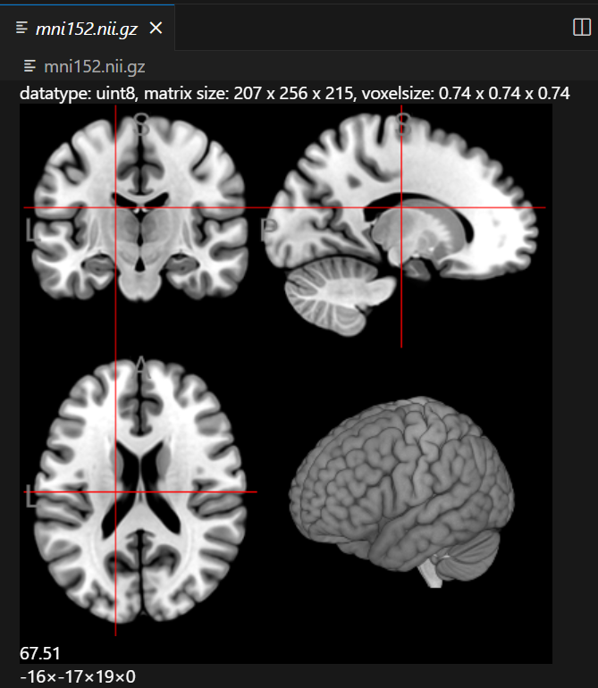
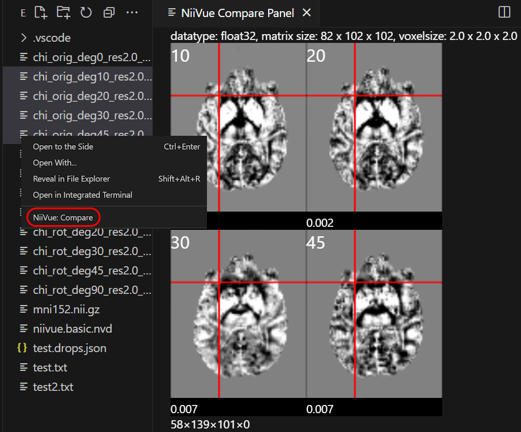
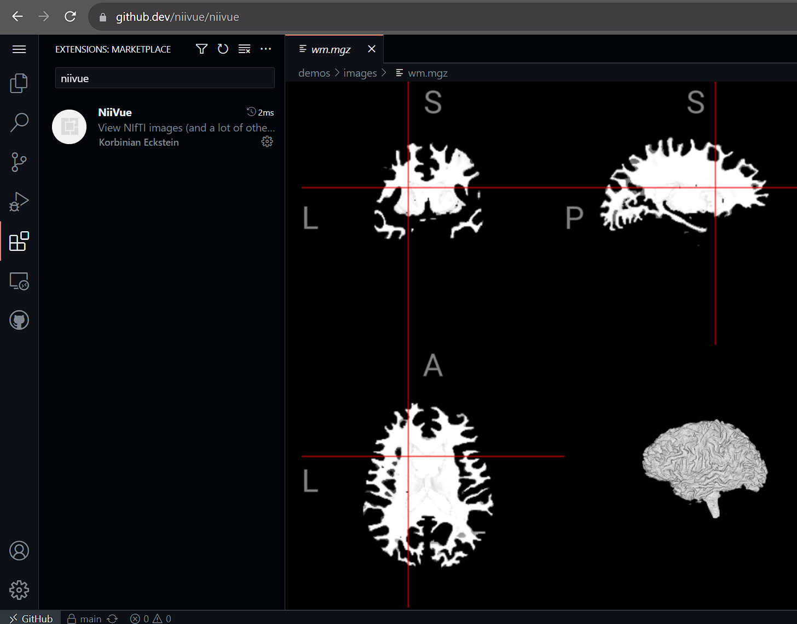

# NiiVue VSCode README

**WebGL 2.0 medical image viewer**  
This extension uses [NiiVue](https://github.com/niivue/niivue) to display images selected in VSCode.

## VS Code version

The VS Code extension is published on the [VS Code marketplace](https://marketplace.visualstudio.com/items?itemName=KorbinianEckstein.niivue) and can be installed via the extension tab in VS Code, searching for `niivue`

## Browser version

The [web version](https://korbinian90.github.io/niivue-vscode) can be installed as a local app with file associations (only supported in Chrome)

## Development

Currently my time that I can spend on this project is quite limited. I'm very happy for contributions in the form of pull requests.  
Otherwise, if you would like to see a certain feature implemented, please let me know so I can prioritize the development. Either create a new issue or comment/react on an existing issue.

## VS Code screenshots




## List of Hotkeys

- `Right Mouse`: Drag with the right mouse button to zoom
- `Middle Mouse`: Drag with the right mouse button to pan
- `Mouse Scroll`: Change slice in currently hovered image
- `← →`: change volume in 4D image
- `V`: Cycle through viewmodes
- `C`: Cycle through clip plane orientations in 3D render
- `shift`: Changes mouse behaviour to 2D dragging and 3D viewplane rotation
- `H`: Move the cross to R
- `L`: Move the cross to L
- `J`: Move the cross to P
- `K`: Move the cross to A
- `ctrl+U`: Move the cross to S
- `ctrl+D`: Move the cross to I

## Features

- Open local files by selecting them in the VSCode explorer
- Selecting multiple files -> right click -> NiiVue: Compare
- Open web links to files with the command "NiiVue: Open Image" (`Ctr+Shift+P`)
- Open local or remote files when hovering over the link in an open editor
- Add overlays
- Works in web-based VSCode
  

## Supported Formats

NiiVue can open several formats popular with brain imaging:

- Voxel-based formats: [NIfTI](https://brainder.org/2012/09/23/the-nifti-file-format/), [NRRD](http://teem.sourceforge.net/nrrd/format.html), [MRtrix MIF](https://mrtrix.readthedocs.io/en/latest/getting_started/image_data.html#mrtrix-image-formats), [AFNI HEAD/BRIK](https://afni.nimh.nih.gov/pub/dist/doc/program_help/README.attributes.html), [MGH/MGZ](https://surfer.nmr.mgh.harvard.edu/fswiki/FsTutorial/MghFormat), [ITK MHD](https://itk.org/Wiki/ITK/MetaIO/Documentation#Reading_a_Brick-of-Bytes_.28an_N-Dimensional_volume_in_a_single_file.29), [ECAT7](https://github.com/openneuropet/PET2BIDS/tree/28aae3fab22309047d36d867c624cd629c921ca6/ecat_validation/ecat_info).
- Mesh-based formats: [GIfTI](https://www.nitrc.org/projects/gifti/), [ASC](http://www.grahamwideman.com/gw/brain/fs/surfacefileformats.htm), [BYU/GEO/G](http://www.grahamwideman.com/gw/brain/fs/surfacefileformats.htm), [BrainSuite DFS](http://brainsuite.org/formats/dfs/), [ICO/TRI](http://www.grahamwideman.com/gw/brain/fs/surfacefileformats.htm), [PLY](<https://en.wikipedia.org/wiki/PLY_(file_format)>), [BrainNet NV](https://www.nitrc.org/projects/bnv/), [BrainVoyager SRF](https://support.brainvoyager.com/brainvoyager/automation-development/84-file-formats/344-users-guide-2-3-the-format-of-srf-files), [FreeSurfer](http://www.grahamwideman.com/gw/brain/fs/surfacefileformats.htm), [MZ3](https://github.com/neurolabusc/surf-ice/tree/master/mz3), [OFF](<https://en.wikipedia.org/wiki/OFF_(file_format)>), [Wavefront OBJ](https://brainder.org/tag/obj/), [STL](https://medium.com/3d-printing-stories/why-stl-format-is-bad-fea9ecf5e45), [Legacy VTK](https://vtk.org/wp-content/uploads/2015/04/file-formats.pdf), [X3D](https://3dprint.nih.gov/).
- Mesh overlay formats: [GIfTI](https://www.nitrc.org/projects/gifti/), [CIfTI-2](https://balsa.wustl.edu/about/fileTypes), [MZ3](https://github.com/neurolabusc/surf-ice/tree/master/mz3), [SMP](https://support.brainvoyager.com/brainvoyager/automation-development/84-file-formats/40-the-format-of-smp-files), STC, FreeSurfer (CURV/ANNOT)
- Tractography formats: [TCK](https://mrtrix.readthedocs.io/en/latest/getting_started/image_data.html#tracks-file-format-tck), [TRK](http://trackvis.org/docs/?subsect=fileformat), [TRX](https://github.com/frheault/tractography_file_format), VTK, AFNI .niml.tract
- DICOM: [DICOM](https://dicom.nema.org/medical/dicom/current/output/chtml/part10/chapter_7.html) and [DICOM Manifests](docs/development-notes/dicom-manifests.md)

If niivue-vscode fails to open any of these files, please create an issue.

## Developing this extension in VSCode

- Fork this repository;
- Clone [this repository](https://github.com/niivue/niivue-vscode) and open in VSCode
- Run inside the `niivue-vscode` folder

### Installing

This project uses pnpm for package management and Turborepo for build orchestration.

```bash
pnpm install
```

### Development Workflow

For development with live reload:

```bash
# Start the VS Code extension in watch mode
pnpm --filter @niivue/vscode watch
```

### Debugging the extension in vscode

- Ensure the watch task is running (see above)
- Press `F5` (a new VSCode window opens: Extension Development Host)
- Test the extension in the Extension Development Host by opening an image file
- Press `Ctrl+R` in the Extension Development Host for reload after a code change

### Building

To build the extension:

```bash
# Build all dependencies and the extension
pnpm build

# Or build just the VS Code extension and its dependencies
pnpm --filter @niivue/vscode build
```

### Testing

Run tests across the monorepo:

```bash
pnpm test
```

### Publishing

#### Option 1: Automated Release via GitHub Actions

**Tag-based release:**

```bash
# Create and push a tag (replace x.y.z with actual version)
git tag vscode-vx.y.z
git push origin vscode-vx.y.z
```

The GitHub Action will automatically:

- Build the extension
- Publish to VS Code Marketplace
- Publish to Open VSX Registry
- Create a GitHub release
- Upload the `.vsix` file as an artifact

**Prerequisites:**

- Repository secrets must be configured (for automated releases):
  - `VSCE_PAT`: Personal Access Token for VS Code Marketplace
  - `OVSX_PAT`: Personal Access Token for Open VSX Registry

#### Option 2: Manual Publishing

For manual publishing, you'll need to install the publishing tools and have the necessary access tokens:

```bash
# Install publishing tools globally
npm install -g @vscode/vsce ovsx

# Navigate to the VS Code extension directory
cd apps/vscode

# Build the extension
pnpm build

# Update version in package.json (optional - vsce can do this automatically)
# Then publish to VS Code Marketplace
vsce publish patch|minor|major [--pre-release]

# Publish to Open VSX Registry
ovsx publish --pat <openVSX access key>
```

**Prerequisites:**

- Personal Access Token for [VS Code Marketplace](https://marketplace.visualstudio.com/manage)
- Personal Access Token for [Open VSX Registry](https://open-vsx.org/)
